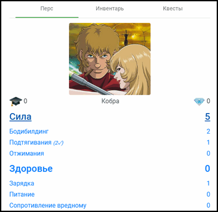

# РПГ Органайзер: веб версия

Это исходный код сетевой версии [программы РПГ Органайзер](http://nerdistway.blogspot.com/2013/07/mylife-rpg-organizer.html).

**РПГ Органайзер это…**

**С одной стороны - необычный таск-менеджер (ToDo List)**, в том плане, что ты назначаешь себе задания и выполняешь.

**С другой - игра**, нацеленная на самосовершенствование.

**РПГ Органайзер это инструмент** для самосовершенствования, организации режима дня и достижения баланса.

Создай персонажа, олицетворяющего тебя. Настрой способности, придумай увлекательные квесты и выполняй действия, повышающие твой уровень!

**РПГ Органайзер** - продвинутый гибрид ToDo списка и ролевой компьютерной игры.

Аналоги:

- [Habitica](https://habitica.com/static/home)
- [Life RPG](https://play.google.com/store/apps/details?id=com.jayvant.liferpgmissions&hl=en)
- [Epic Win](https://play.google.com/store/apps/details?id=com.supermono.epicwin&hl=ru)
- [RPG Organizer Desctop](https://github.com/pashkas/rpgorganizer_desctop)

## Скриншоты

*Экран персонажа*:

*Турнирная таблица:*

*Панель задач:*

## Попробовать программу

[Зарегистрируйтесь по этому адресу](http://nerdistway.blogspot.com/2013/07/mylife-rpg-organizer.html) и получите доступ к рабочей веб версии приложения.

## Как осуществлять разработку

Склонируй к себе на комьютер репозиторий. 

Воспользуйся **Visual Studio Code**, установи **Node.js** вооружись знаниями **Typescript** и **Angular**.  Запусти комманду ng-install, ng-serve.

Дерзай!